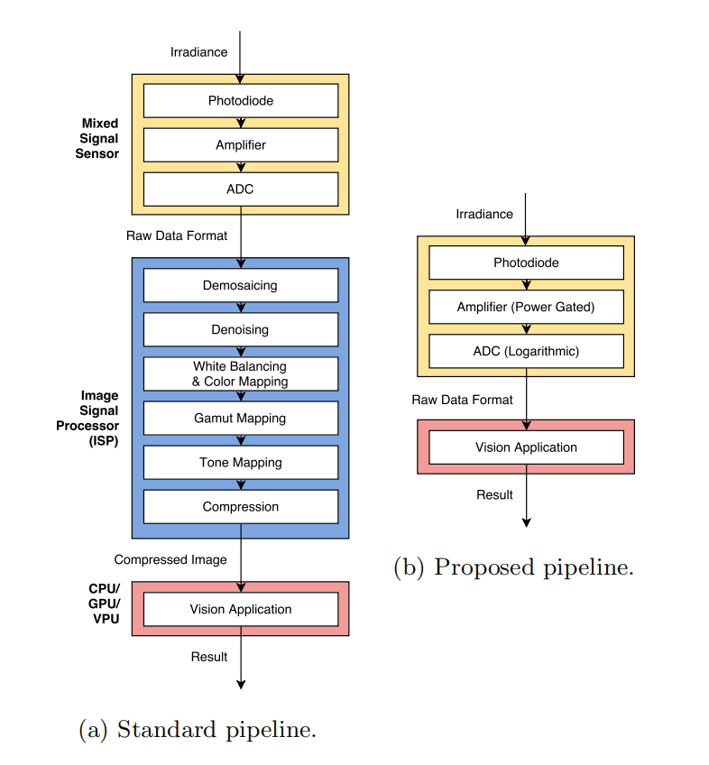

# literature notes for ISP

---

## Reconfiguring the Imaging Pipeline for Computer Vision

Buckler, Mark, Suren Jayasuriya, and Adrian Sampson. "Reconfiguring the imaging pipeline for computer vision." *Proceedings of the IEEE International Conference on Computer Vision*. 2017.

### Aim

* Make imaging pipelines configurable: the imaging pipelines can switch between a traditional **photography mode** and a low-power **vision mode** that produces lower-quality image data suitable only for computer vision. In **vision mode**, the sensor can save energy by producing lower-resolution, lower-precision image data, and **the ISP can skip stages or disable itself altogether**.

### Background

* Hardware acceleration for embedded machine vision only reduces the energy cost of the inference, **DOSE NOT** address the cost of capturing & processing, which consume a large share of total system power.
* Existing imaging pipelines are designed for producing high-quality images for human consumption, while modern CV algorithms do not require the same level quality.

### Conclusion

* Most traditional ISP stages are unnecessary when targeting CV, for all but one application in this paper, **ONLY** demosaicing & gamma compression had significant effects on vision accuracy.
* The new image sensor proposed in this paper can approximate the effect of demosaicing & gamma compression, making it possible to **disable all the ISP stages** in vision mode.
* By reducing the **bitwidth** of ADC from 12 to 5, and replacing the **linear** ADC quantization with **logarithmic** quantization, the new sensor can still maintain the same level of task performance.
* Altogether, this vision mode can save **∼75%** of the average energy of a baseline photography mode with only a small impact on vision task accuracy.

### Methods & Results

<这里概括一下，用了xxx方法实现了xxx的结果>

#### Experimental Setup

* The imaging pipeline: 

  * They consider a typical set of stages common to all ISP pipeline, including **demosacing**, **denoising**, **color mapping**, **gamut mapping**, **Tone mapping** and **Compression**.
  * Use a simple form of **tone mapping** which perform **gamma compression**.
  * Omit analyses that control the sensor, such as autoexposure, autofocus, burst photography and HDR mode.

  

* Pipeline simulation tool

  * Create a Configurable & Reversible Imaging Pipeline (CRIP) to generate **labeled images**.
  * CRIP takes as input a standard image file, runs the inverse conversion to approximate a **RAW image**, and then simulates a specific sensor/ISP configuration to produce a final **RGB image**.
  * CRIP uses reversible ISP model of Kim et al. (Kim, Seon Joo, et al. "A new in-camera imaging model for color computer vision and its application." *IEEE Transactions on Pattern Analysis and Machine Intelligence* 34.12 (2012): 2289-2302.) and adds stages including reverse denoising and demosaicing as well as re-quantization.
  *  

#### Thoughts / Comments

### Related work or knowledge

---

## Reconfiguring the Imaging Pipeline for Computer Vision: Supplemental Material

Buckler, Mark, Suren Jayasuriya, and Adrian Sampson. "Reconfiguring the Imaging Pipeline for Computer Vision: Supplemental Material."

---

## VisionISP: Repurposing the Image Signal Processor for Computer Vision Applications

Wu, Chyuan-Tyng, et al. "Visionisp: Repurposing the image signal processor for computer vision applications." *2019 IEEE International Conference on Image Processing (ICIP)*. IEEE, 2019.

### Aim

### Background

### Conclusion

### Methods & Results

### Related knowledge

---

## Minimalistic Image Signal Processing for Deep Learning Applications

Lubana, Ekdeep Singh, et al. "Minimalistic Image Signal Processing for Deep Learning Applications." *2019 IEEE International Conference on Image Processing (ICIP)*. IEEE, 2019.

### Aim

### Background

### Conclusion

### Methods & Results

### Related knowledge